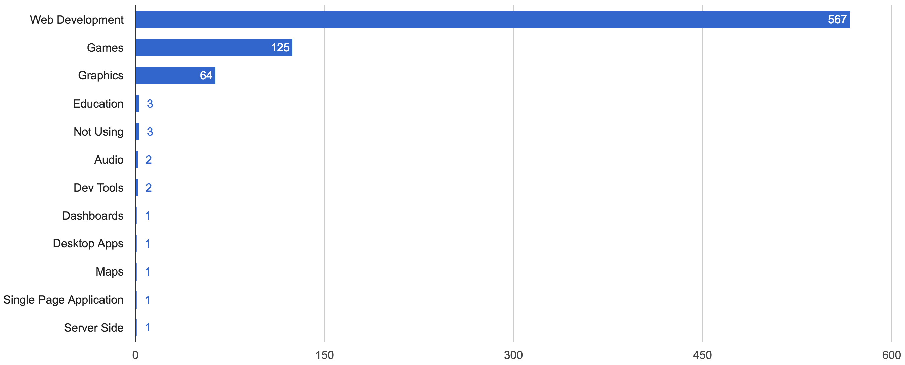
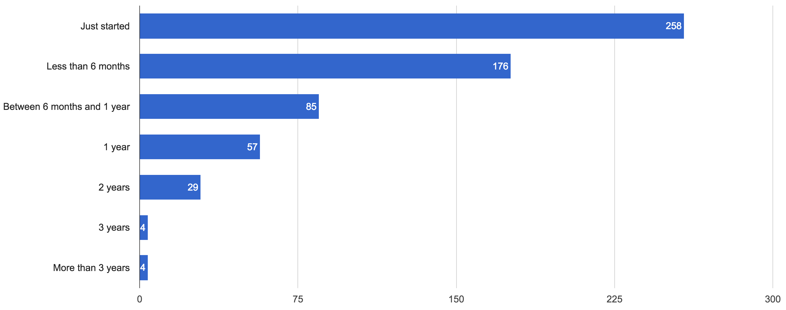
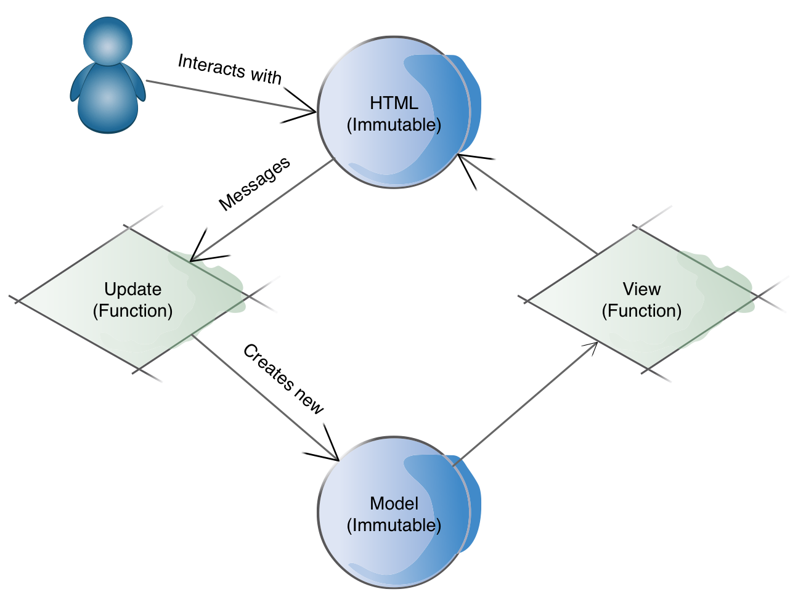
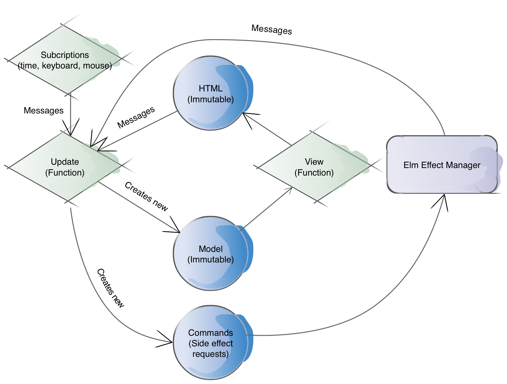

footer: Introduction to Elm / @gbelrose / Jozi.js 07-2017
slidenumbers: true

# Elm

## **Fun**ctional JavaScript for front-end Web Applications

### Guillaume (G) Belrose / @gbelrose

---
# Survey time

---

# What is Elm?

- By Evan Czaplicki
- Compiles to JavaScript
- FP language, static typing
- Purpose-built for web UIs
- Virtual DOM
- **Opinionated** model for web UIs

---

# Why bother?

- NoRedInk (tech-ed startup)
- 100K LOC Elm codebase
- 1 (as in ONE ) runtime error within 1 year of operation
- Yes, I said 1 error/year not 1 error/minute :-)

---

# Use cases



---

# A young language



---

# FP in Elm

- Stateless (**pure**) functions
- **Immutable** values
- Modules
- No classes / objects / inheritance / prototypes!!

---

# Getting started

- Cross platform tool chain (written in Haskell)
- `npm install elm`
- elm-make, elm-reactor, elm-package
- Community tools:
 - elm-format
 - Plugins (Atom, VSCode, etc..)

---
# Syntax overview

- Usual types (Int, Bool, String), No nulls (Maybe, Result)
- Immutable (persistent) data structures (list, sets, etc...)
- Union types
- Records (i.e. typed JSON)
- `if .. then` / `let .. in` expressions
- Pattern matching (case expressions)


---
# Functions
- `fn: TypeA -> TypeB -> .. -> ReturnType`
- `fn: ReturnType`
- `fn: a -> Int -> String`
- `hof: (a -> b) -> a -> b`
- `hof: a -> b -> (a -> b)`

---
# Hello, Elm!

```json
{
    "version": "1.0.0",
    "summary": "Simple Elm examples for the Jozi.js Meetup",
    "repository": "https://github.com/user/project.git",
    "license": "BSD3",
    "source-directories": [
        "."
    ],
    "exposed-modules": [],
    "dependencies": {
        "elm-lang/core": "5.1.1 <= v < 6.0.0",
        "elm-lang/html": "2.0.0 <= v < 3.0.0",
        "elm-lang/http": "1.0.0 <= v < 2.0.0",
        "elm-lang/keyboard": "1.0.1 <= v < 2.0.0"
    },
    "elm-version": "0.18.0 <= v < 0.19.0"
}
```

---
# Hello, Elm!

```elm
module HelloElm exposing (..)

import Html exposing (..)


main =
    text "Hello, Elm!"
```

---
# Workflow

```bash
elm-make HelloElm.elm
```

```bash
elm-make HelloElm.elm --output HelloElm.js
```

```bash
-rw-r--r--   1 guillaume  staff        90 27 Mar 18:50 HelloElm.elm
-rw-r--r--   1 guillaume  staff    178639  5 Apr 17:12 HelloElm.js
-rw-r--r--   1 guillaume  staff    178928  5 Apr 17:11 index.html
```

---

# It's just HTML / JS / CSS

```html
<div id="main"></div>
<script src="main.js"></script>
<script>
    var node = document.getElementById('main');
    var app = Elm.Main.embed(node);
</script>
```

---

# Functions and the Virtual DOM

## Live coding #1

---

# The Elm architecture



---

# Angular Elm

## Live demo #2

---

# The Elm architecture (part II)



---

# Side effects as **Data**

- Describe the event stream(s) you subscribe to
- Or the side effect(s) you want to execute
 - Random generation
 - HTTP requests
- The Elm runtime takes over and does it for you

---

# HTTP requests 

- Describe the URL to GET | POST | etc...
- Describe what to do with the HTTP response
 - How to decode it?
 - What to do with errors | decoded output?
- Submit recipe above to the Elm effect manager

---

# JavaScript interop with ports

- Port: bridge between Elm and JavaScript
- Define Elm _interfaces_ for the outgoing / incoming side effects
- Write some JS code for the side effects
- _JavaScript as a Service_


---
# Ports from Elm

```elm
{- Play a given sample at given point in time in the future -}


port playSample : ( SampleAlias, Float ) -> Cmd msg
```

---

# Ports from JavaScript

```javascript
app.ports.playSample.subscribe(function (array){
    var key = array[0];
    var when = array[1];
    var source = audioContext.createBufferSource();
    source.buffer = samples[key];
    source.connect(audioContext.destination);
    source.start(when);
});
```
---

# A drum machine

## Live demo #3

---
# What about testing?

- Use the compiler as much as possible !!!
 - Making impossible states impossible
- Unit testing / property-based testing with elm-test
- Use Capybara / webdriver.io for end to end / acceptance tests

---

# Elm cons

- Might not be your type
- It is not x ( x = your language of choice..)
- Not backed by Google | Facebook | Microsoft
- Only at version 0.18 
- Pure FP / managed side effects might seem alien

---

# Elm pros 

- Beginner friendly language
- Great language for learning FP
- Compiler is fast | extremely user friendly
- Refactoring, trade runtime errors for compile errors
- Very inclusive and friendly community

---

# Fin

---

# Like what you saw?

## Lambda Luminaries Meetup

## 2nd Monday of the Month @Jemstep

--—

## Questions / Comments ?

